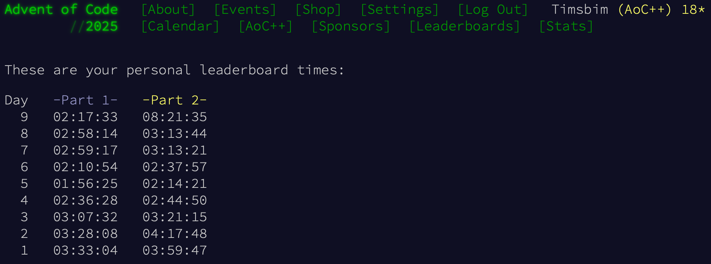

# Solutions of the [Advent of Code 2025][AoC] mysteries.

Thank you [Eric Wastl][Eric] for creating this great source of joy! 🎄

All solutions here are from me, found without any help. There's aboslutely no shame in getting help - but I like the challenge. The initial solutions are usually messy and take longer to run, the ones here are refactored and optimised. I'm running the code mostly in [PyPy][PyPy] to speed it up a little bit. As [requested][AoC_About] by Eric, the repository doesn't contain any inputs.

My statistics ⭐:

 [AoC]:https://adventofcode.com/2025
 [Eric]:https://was.tl
 [AoC_About]:https://adventofcode.com/2025/about
 [PyPy]:https://pypy.org
